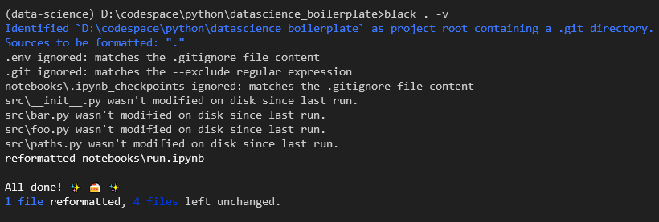

# Data Science ML Boilerplate. ```[ Flat is better than nested ]```


Starting a new Data Science / ML project from the scratch  .

### Virtual environment creation [ using venv ]

1. Run ```python -m venv --prompt <promt> .venv``` 
2. Check project root directory, it should have ```.venv``` directory
3. Activate virtual environment 
    - For Windows  ```.venv\Scripts\activate.bat```
    - For Linux  ```source .venv/bin/activate```
4. Check new python interpreter path    
    - For Windows  ```where python```
    - For Linux  ```which python```
    - It should point ```${Project_root}/.venv/Scripts/python```
5. install dependency using ```pip install <package_name>```

### Jupyter installation for the environment [ Optional ]

Installation can be done ```pip install Jupyter```. However big list dependency of Jupyter can be avoided by installting ipython kernel module only, if you have Jupyter installed Globally.

1. ```pip install ipykernel```
2. ```python -m ipykernel install --user --name=<promt>```
3. You should now be able to see your kernel in the IPython notebook menu: Kernel -> Change kernel

    

4. To Remove the kernel 
    - ```jupyter kernelspec list``` this list down all installed kernal.
    - ```jupyter kernelspec uninstall unwanted-kernel``` removes the kernal.  


### Linting [ using flake8 ]

1. Linting error from VS-CODE editor

    

2. Run linting form cmd using  ```flake8 . -v```

    

3. Disable linting for a specific line, example
    ```
        import config.logging_settings # noqa <Error No>
    OR 
        global VAR # noqa <Error No>
    ```
4. Awsome Flake-8 [Plugin](https://github.com/DmytroLitvinov/awesome-flake8-extensions#all-in-one) list


### Cleaning the cache files [ using pyclean ]

Run ``` pyclean src/ tests/ -v```

### Code Formating [ using black ]

Run ```black . -v```



### Runing jupyter notebook from remote shell

1. First Run ```jupyter notebook``` from project directory of remote server.
2. Notedown the port number .
3. Finally run the following commands from local meachine
    ```ssh -L 8888:localhost:<remote_port> <remote_user_name>@<remote_ip>```
4. Point the browser at ```localhost:8888```    


### Finally

from CLI ```python main.py``` OR ```python -m src.bar```


### Unit Testing

from CLI run ```python -m unittest ``` for verbose mode  ```python -m unittest -v```